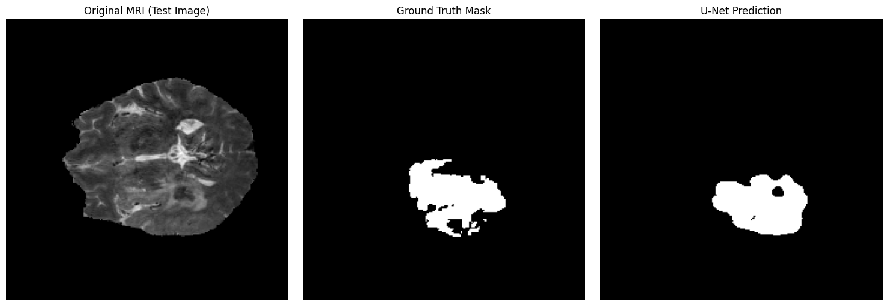

# U-Net Brain Tumor Segmentation (BraTS2020)

A PyTorch implementation of **U-Net** for **binary brain tumor segmentation** on the BraTS2020 2D Multichannel dataset.

## Results

- **Best Validation Dice Score: 0.7976**
- Trained for 200 epochs on Google Colab (T4 GPU)

### Learning Curves


### Test Prediction



## Architecture

The model uses a standard **U-Net** encoder-decoder architecture with skip connections:

- **Encoder**: 4 levels of `DoubleConv` (Conv2d → BatchNorm → ReLU) × 2 + MaxPool
- **Bottleneck**: DoubleConv block
- **Decoder**: 4 levels of ConvTranspose2d (upsample) + skip connection concatenation + DoubleConv
- **Output**: 1×1 Conv2d → sigmoid for binary prediction

| Component | Details |
|-----------|---------|
| Input | RGB MRI images (3 channels) |
| Output | Binary tumor mask (1 channel) |
| Feature sizes | [64, 128, 256, 512] |
| Loss function | BCEWithLogitsLoss (pos_weight=5.0) |
| Optimizer | Adam (lr=1e-4) |
| Scheduler | ReduceLROnPlateau (patience=5) |
| Metric | Dice Coefficient |

## Dataset

**BraTS2020 2D Multichannel** from Kaggle:
- 368 brain MRI images with corresponding segmentation masks
- Split: 80% train / 10% validation / 10% test

📥 Download: [Kaggle - 2D Multichannel BraTS2020](https://www.kaggle.com/datasets/alilebanizakaria/2d-multichannel-brats2020)

After downloading, place the dataset folder in the project directory:
```
Image_segmentation_unet/
├── BraTS2020 2D Multichannel/
│   ├── Images/
│   ├── Masks/
│   └── metadata.csv
├── unet_brain_tumor_segmentation.py
└── ...
```

## Setup

### 1. Install dependencies

```bash
pip install -r requirements.txt
```

### 2. Download dataset

Download from Kaggle and extract to the project directory. Or use the download script:

```python
import kagglehub
path = kagglehub.dataset_download("alilebanizakaria/2d-multichannel-brats2020")
print("Path to dataset files:", path)
```

### 3. Run training

```bash
# Default settings (100 epochs, batch_size=16)
python unet_brain_tumor_segmentation.py

# Custom settings
python unet_brain_tumor_segmentation.py --epochs 200 --batch_size 8 --lr 1e-4

# Specify dataset path
python unet_brain_tumor_segmentation.py --data_dir "path/to/BraTS2020 2D Multichannel"
```

### Command Line Arguments

| Argument | Default | Description |
|----------|---------|-------------|
| `--data_dir` | `BraTS2020 2D Multichannel` | Path to dataset directory |
| `--epochs` | `100` | Number of training epochs |
| `--batch_size` | `16` | Batch size |
| `--lr` | `1e-4` | Learning rate |
| `--pos_weight` | `5.0` | Positive class weight for BCE loss |
| `--model_path` | `best_unet_model.pth` | Path to save best model |

## Project Structure

```
Image_segmentation_unet/
├── unet_brain_tumor_segmentation.py   # Main training script
├── requirements.txt                    # Python dependencies
├── README.md                           # This file
├── .gitignore                          # Git ignore rules
├── test_prediction_visulization.png    # Sample prediction output
└── val_dice 3.png                      # Training curves
```

## Tech Stack

- Python 3.8+
- PyTorch
- NumPy
- Matplotlib
- Pandas
- scikit-learn
- Pillow


## Contact
- Email: [manolinadas2004@gmail.com]
